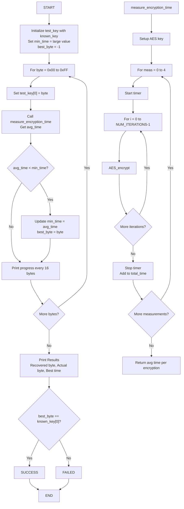

# AES Side-Channel Attack Demo using perf events

This directory demonstrates cache timing side-channel attacks for AES key extraction using Linux perf events on Raspberry Pi.

## Overview

This demo shows how performance counters can leak cryptographic keys through cache timing measurements during AES encryption operations.

## Components

- `aes_victim.c` - Victim process performing AES encryption
- `perf_spy.c` - Attacker process using perf events to monitor cache activity
- `key_extractor.c` - Automated key recovery using cache timing measurements
- `Makefile` - Build configuration

## Requirements

- Raspberry Pi (tested on Pi 4)
- Linux kernel with perf events support
- Root access for perf monitoring
- OpenSSL development libraries

## Build

```bash
make
```

## Usage

### Terminal 1 - Run victim (performs AES encryption)

```bash
sudo ./aes_victim
```

### Terminal 2 - Run spy (monitors cache events)

```bash
sudo ./perf_spy $(pgrep aes_victim)
```

### Automated Key Recovery

```bash
sudo ./key_extractor
```

This program attempts to recover the first byte of the AES key by measuring encryption timing for each possible key value (0x00-0xFF).

#### Program Logic Flow (Mermaid)



#### Program Logic Flow (ASCII)

```text
START
  |
  v
Initialize test_key with known_key (except first byte)
  |
  v
Set min_time = large value, best_byte = -1
  |
  v
For byte = 0x00 to 0xFF:
  |
  +--> Set test_key[0] = byte
  |     |
  |     v
  |   Call measure_encryption_time(test_key)
  |     |
  |     v
  |   If avg_time < min_time:
  |     |
  |     +--> min_time = avg_time
  |     |     best_byte = byte
  |     |
  |     v
  |   Print progress every 16 bytes
  |
  v
Print Results:
- Recovered byte: best_byte
- Actual byte: known_key[0]
- Best time: min_time
  |
  v
If best_byte == known_key[0]:
  |
  +--> SUCCESS
  |
  v
Else:
  |
  +--> FAILED
  |
  v
END

measure_encryption_time(key):
  |
  v
Setup AES key with provided key
  |
  v
For meas = 0 to 4 (5 measurements):
  |
  +--> Start timer
  |     |
  |     v
  |   For i = 0 to NUM_ITERATIONS-1:
  |     |
  |     +--> AES_encrypt(plaintext, ciphertext, enc_key)
  |     |
  |     v
  |   Stop timer
  |     |
  |     v
  |   Add time_taken to total_time
  |
  v
Return total_time / (5 * NUM_ITERATIONS)
```

## What it demonstrates

1. **Cache timing**: AES table lookups create measurable cache access patterns
2. **Perf events**: Kernel perf subsystem exposes cache miss/hit counters
3. **Side-channel leakage**: Cache behavior correlates with secret key bits
4. **Key recovery**: Statistical analysis of timing data can recover cryptographic keys

## Security implications

- Even isolated processes can leak secrets via shared CPU resources
- Hardware performance counters provide high-resolution timing
- Demonstrates why constant-time crypto implementations are critical

## References

- [Flush+Reload: a High Resolution, Low Noise, L3 Cache Side-Channel Attack](https://eprint.iacr.org/2013/448.pdf)
- [Prime+Probe: A Novel Side-Channel Attack on ARM Caches](https://eprint.iacr.org/2016/702.pdf)
