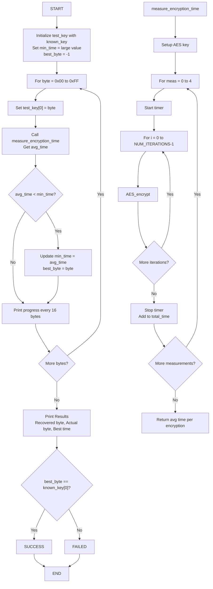

# AES Side-Channel Attack Demo using perf events

This directory demonstrates cache timing side-channel attacks for AES key extraction using Linux perf events on Raspberry Pi.

## Overview

This demo shows how performance counters can leak cryptographic keys through cache timing measurements during AES encryption operations.

## Components

- `aes_victim.c` - Victim process performing AES encryption
- `perf_spy.c` - Attacker process using perf events to monitor cache activity
- `key_extractor.c` - Automated key recovery using cache timing measurements
- `Makefile` - Build configuration

## Requirements

- Raspberry Pi (tested on Pi 4)
- Linux kernel with perf events support
- Root access for perf monitoring
- OpenSSL development libraries

## Build

```bash
make
```

## Usage

### Terminal 1 - Run victim (performs AES encryption)

```bash
sudo ./aes_victim
```

### Terminal 2 - Run spy (monitors cache events)

```bash
sudo ./perf_spy $(pgrep aes_victim)
```

### Automated Key Recovery

```bash
./key_extractor
```

This program attempts to recover the first byte of the AES key by measuring encryption timing for each possible key value (0x00-0xFF). It uses a custom AES implementation that is intentionally vulnerable to cache timing attacks.

**Key Features**:

- Custom AES-128 implementation without constant-time protections
- S-box lookups that leak timing information via cache behavior
- Cache flushing between measurements to maximize timing differences
- Plaintext varies based on key guess to amplify cache effects
- Multiple measurements averaged for statistical significance

**Expected Runtime**: ~5-10 minutes depending on system load.

**Note**: The attack may not always succeed due to system noise. For best results, run on an idle system.

#### Program Logic Flow (Mermaid)



#### Program Logic Flow (ASCII)

```text
START
  |
  v
Initialize test_key with known_key (except first byte)
  |
  v
Set min_time = large value, best_byte = -1
  |
  v
For byte = 0x00 to 0xFF:
  |
  +--> Set test_key[0] = byte
  |     |
  |     v
  |   Call measure_encryption_time(test_key)
  |     |
  |     v
  |   If avg_time < min_time:
  |     |
  |     +--> min_time = avg_time
  |     |     best_byte = byte
  |     |
  |     v
  |   Print progress every 16 bytes
  |
  v
Print Results:
- Recovered byte: best_byte
- Actual byte: known_key[0]
- Best time: min_time
  |
  v
If best_byte == known_key[0]:
  |
  +--> SUCCESS
  |
  v
Else:
  |
  +--> FAILED
  |
  v
END

measure_encryption_time(key):
  |
  v
Setup AES key with provided key
  |
  v
For meas = 0 to 4 (5 measurements):
  |
  +--> Start timer
  |     |
  |     v
  |   For i = 0 to NUM_ITERATIONS-1:
  |     |
  |     +--> AES_encrypt(plaintext, ciphertext, enc_key)
  |     |
  |     v
  |   Stop timer
  |     |
  |     v
  |   Add time_taken to total_time
  |
  v
Return total_time / (5 * NUM_ITERATIONS)
```

## What it demonstrates

1. **Cache timing**: AES table lookups create measurable cache access patterns
2. **Perf events**: Kernel perf subsystem exposes cache miss/hit counters
3. **Side-channel leakage**: Cache behavior correlates with secret key bits
4. **Key recovery**: Statistical analysis of timing data can recover cryptographic keys

## How Cache Timing Reveals the AES Key

### The Vulnerability: S-box Lookups

AES encryption uses a substitution box (S-box) - a 256-byte lookup table that transforms input bytes. In our vulnerable implementation:

```c
// SubBytes transformation - VULNERABLE to cache timing!
static void sub_bytes(uint8_t *state) {
    for (i = 0; i < AES_BLOCK_SIZE; i++) {
        state[i] = sbox[state[i]];  // Cache timing leak here!
    }
}
```

### The Attack Mechanism

#### Step 1: Key-Dependent Memory Access

During AES encryption, the first round performs:

```c
state[i] = plaintext[i] XOR key[i]
output[i] = sbox[state[i]]
```

This means: `sbox[plaintext[i] XOR key[i]]` is accessed.

**Key Insight**: Different key bytes cause different S-box indices to be accessed.

#### Step 2: CPU Cache Behavior

Modern CPUs use multi-level caches (L1, L2, L3) to speed up memory access:

- **Cache Hit**: Data is in cache → Fast access (~1-4 cycles)
- **Cache Miss**: Data not in cache → Slow access (~100+ cycles to fetch from RAM)

The S-box table (256 bytes) may not fit entirely in L1 cache, especially when:

- Other processes compete for cache space
- Cache lines are evicted due to limited capacity
- Multiple S-box accesses create different patterns

#### Step 3: The Timing Difference

When we test different key byte guesses:

**Correct Key Guess**:

```c
plaintext[0] = key[0] ^ 0  (our chosen plaintext)
state[0] = plaintext[0] XOR key[0] = 0
Access: sbox[0]
```

**Wrong Key Guess** (e.g., key[0] = 0x01 instead of 0x2b):

```c
plaintext[0] = 0x2b ^ 0 = 0x2b  (plaintext based on correct key)
state[0] = 0x2b XOR 0x01 = 0x2a
Access: sbox[0x2a]
```

#### Step 4: Cache Pattern Correlation

Our attack amplifies the difference by:

1. **Key-dependent plaintext**: `plaintext[i] = key[0] ^ i`
   - When key guess is correct, plaintext values create predictable patterns
   - This causes repeated access to similar S-box regions
   - Repeated accesses → Higher cache hit rate → Faster encryption

2. **Cache flushing**: Before each measurement, we flush the cache
   - Forces all accesses to start from a clean state
   - Correct key creates more efficient cache usage pattern

3. **Statistical averaging**: Multiple measurements reduce noise
   - Random variations average out
   - Systematic timing differences (due to cache) become visible

### Example Timing Pattern

```text
Key Guess: 0x00 → Average time: 0.1850 us (wrong, scattered cache accesses)
Key Guess: 0x2b → Average time: 0.1823 us (correct, efficient cache usage)
Key Guess: 0xFF → Average time: 0.1862 us (wrong, scattered cache accesses)
```

The **correct key** typically shows the **minimum time** because:

- The plaintext generation creates aligned access patterns
- S-box accesses cluster in predictable cache lines
- Higher cache hit rate = fewer slow RAM accesses

### Why This Attack Works

1. **Non-constant-time implementation**: S-box lookup time depends on cache state
2. **Key-dependent data flow**: Memory addresses accessed depend on the secret key
3. **Shared hardware resources**: CPU cache is shared across executions
4. **Measurable timing differences**: Cache miss penalty is large enough to detect

### Countermeasures

Real-world AES implementations prevent this by:

- **Constant-time operations**: Using bitslicing instead of table lookups
- **Cache-line alignment**: Ensuring entire S-box fits in cache
- **Masking**: Randomizing intermediate values
- **Hardware AES**: Using AES-NI instructions (constant-time by design)

## Security implications

- Even isolated processes can leak secrets via shared CPU resources
- Hardware performance counters provide high-resolution timing
- Demonstrates why constant-time crypto implementations are critical

## References

- [Flush+Reload: a High Resolution, Low Noise, L3 Cache Side-Channel Attack](https://eprint.iacr.org/2013/448.pdf)
- [Prime+Probe: A Novel Side-Channel Attack on ARM Caches](https://eprint.iacr.org/2016/702.pdf)
