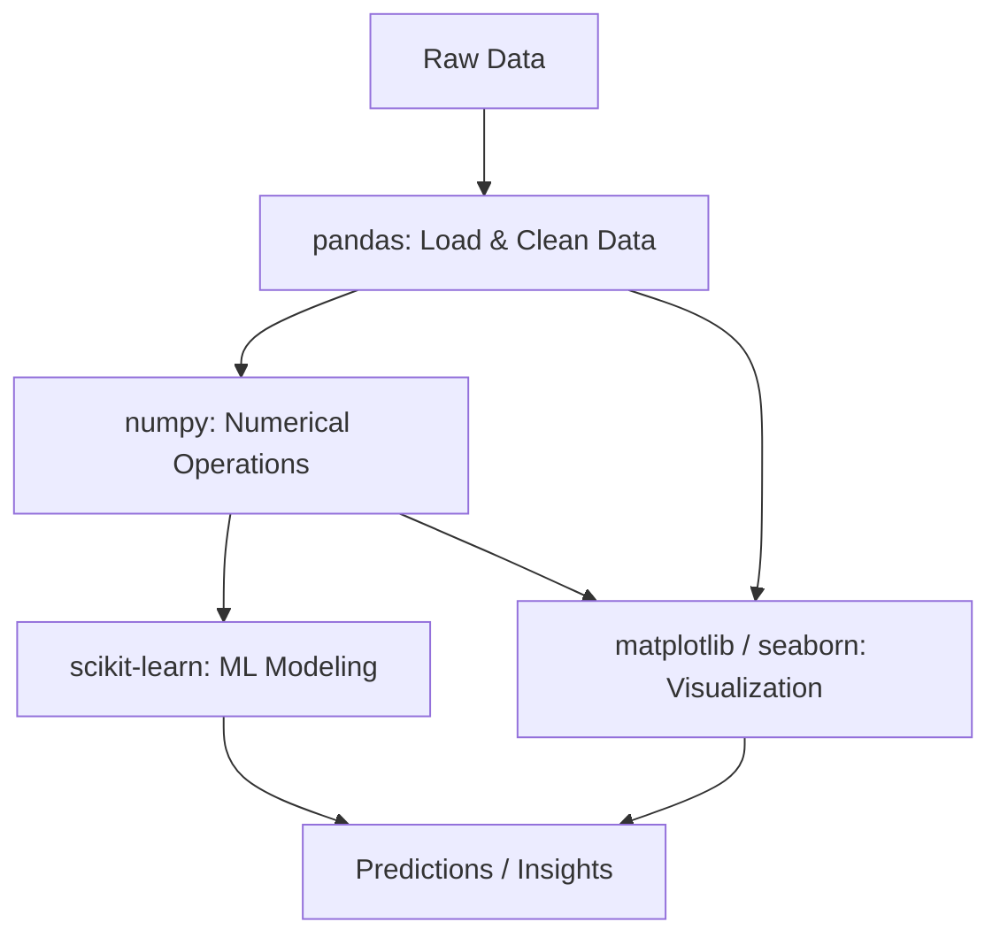

# ML-Based Timing Attack on AES

Machine learning demonstration of cache timing attacks for AES key recovery using statistical analysis of encryption timing measurements.

## Overview

This project demonstrates how machine learning can be used to recover cryptographic keys from timing side-channel leaks. It combines:

- **Vulnerable AES implementation** with timing leaks
- **Timing data collection** across all possible key byte values
- **Machine learning models** (Random Forest, Gradient Boosting) for pattern recognition
- **Statistical analysis** and visualization of timing patterns

## Components

- `vulnerable_aes.h` - Custom AES implementation with artificial timing vulnerabilities
- `collect_timing_data.c` - C program to collect timing measurements
- `ml_key_recovery.py` - Python ML pipeline for key recovery
- `Makefile` - Build and execution automation

## Requirements

### C Compiler
```bash
sudo apt-get install gcc make
```

### Python Dependencies
```bash
pip3 install pandas numpy scikit-learn matplotlib seaborn
```

Or using requirements.txt:
```bash
pip3 install -r requirements.txt
```

## Quick Start

### 1. Build and Run Complete Demo
```bash
make demo
```

This will:
1. Compile the data collector
2. Collect 1,280,000 timing samples (256 key values × 5,000 samples each)
3. Run ML analysis to recover the key byte
4. Generate visualization (timing_analysis.png)

### 2. Step-by-Step Execution

#### Collect Timing Data
```bash
make collect_timing_data
./collect_timing_data timing_data.csv
```

#### Run ML Analysis
```bash
python3 ml_key_recovery.py timing_data.csv
```

## How It Works

### Phase 1: Data Collection

The C program tests all 256 possible values for the first key byte:

```c
for (int key_guess = 0; key_guess < 256; key_guess++) {
    // Setup AES with guessed key
    test_key[0] = key_guess;
    vulnerable_aes_key_expansion(&ctx, test_key);
    
    // Measure encryption timing
    for (int sample = 0; sample < 5000; sample++) {
        timing = measure_timing(&ctx, plaintext);
        // Save: key_guess, plaintext, timing, is_correct
    }
}
```

### Phase 2: Feature Extraction

Statistical features computed for each key guess:
- Mean, median, standard deviation of timings
- Min, max, range
- Quartiles (25th, 75th percentile)

### Phase 3: ML Classification

Two models trained to identify the correct key:

1. **Random Forest**: Ensemble of decision trees
   - Handles non-linear relationships
   - Feature importance analysis

2. **Gradient Boosting**: Sequential boosting
   - Focuses on hard-to-classify samples
   - High accuracy on timing patterns

### Phase 4: Key Recovery

Models predict which key byte value is most likely correct based on timing signatures:

```python
# Get prediction probabilities
probs = model.predict_proba(features)[:, 1]

# Rank candidates by confidence
top_candidates = np.argsort(probs)[-5:][::-1]
```

## The Vulnerability

### Timing Leak in S-box Lookup

```c
static inline uint8_t vulnerable_sbox_lookup(uint8_t index) {
    uint8_t value = sbox[index];
    
    // Artificial delay: 0-7 iterations based on S-box value
    volatile int delay = 0;
    for (int i = 0; i < (value & 0x07); i++) {
        delay += i * i;
    }
    
    return value;
}
```

**Key Insight**: Different key bytes → different S-box values → different delays → measurable timing differences.

### Why This Reveals the Key

1. **First AES round**: `state[i] = plaintext[i] XOR key[i]`
2. **S-box lookup**: `output[i] = sbox[state[i]]`
3. **Timing dependency**: Delay proportional to `sbox[plaintext[i] XOR key[i]]`
4. **Statistical pattern**: Correct key produces unique timing distribution

## Expected Results

### Timing Analysis Output
```
TIMING PATTERN ANALYSIS
=====================================
Top 10 fastest key byte guesses:
key_byte_guess  mean      std       min       max
0x2b            2.456789  0.123456  2.234567  2.789012  <-- CORRECT KEY
0xa3            2.467890  0.134567  2.245678  2.801234
...

CORRECT KEY BYTE: 0x2b
Rank (by speed): 1-5 / 256
```

### ML Model Performance
```
Random Forest Accuracy: 0.95+
Gradient Boosting Accuracy: 0.93+

Top 5 predictions:
  1. Key byte: 0x2b, Confidence: 0.9823 *** CORRECT ***
  2. Key byte: 0xa3, Confidence: 0.0089
  3. Key byte: 0x7f, Confidence: 0.0045
```

## Visualization

The `timing_analysis.png` shows:

1. **Average timing per key byte** (correct key highlighted in red)
2. **Timing distribution** (correct vs incorrect keys)
3. **Feature scatter plot** (mean vs std timing)
4. **Ranking analysis** (correct key position in timing order)

## Security Implications

This demonstrates:

- **Side-channel vulnerabilities** in non-constant-time crypto
- **ML amplification** of subtle timing signals
- **Statistical detectability** even with noise
- **Need for constant-time implementations**

### Real-World Defenses

- **Hardware AES-NI**: Constant-time CPU instructions
- **Bitslicing**: Arithmetic operations instead of table lookups
- **Masking**: Randomize intermediate values
- **Blinding**: Add random delays to obscure patterns

## Performance

- **Data collection**: ~3-5 minutes (256 × 5000 samples)
- **ML training**: ~10-30 seconds
- **Total runtime**: ~5-10 minutes
- **Dataset size**: ~1.3 million samples → ~40 MB CSV

## Customization

### Adjust Sample Size
```c
#define NUM_SAMPLES 5000  // Increase for better accuracy
```

### Change Target Key Byte
```c
static uint8_t secret_key[AES_KEY_SIZE] = {
    0x2b, ...  // Modify first byte to test different values
};
```

### Tune ML Models
```python
RandomForestClassifier(
    n_estimators=200,  # More trees
    max_depth=15       # Deeper trees
)
```

## Troubleshooting

### Low ML Accuracy
- Increase `NUM_SAMPLES` in collect_timing_data.c
- Run on less loaded system (reduce noise)
- Ensure Python dependencies installed correctly

### Timing Differences Too Small
- The artificial delay amplifies real cache timing effects
- Adjust delay loop iterations in `vulnerable_sbox_lookup()`

### Missing Visualization
- Install matplotlib: `pip3 install matplotlib`
- Check for display environment (X11/Wayland)

## References

- [Cache-Timing Attacks on AES](https://cr.yp.to/antiforgery/cachetiming-20050414.pdf)
- [Machine Learning Side-Channel Attacks](https://eprint.iacr.org/2018/387.pdf)
- [Constant-Time Cryptography](https://bearssl.org/constanttime.html)

## Workflow 



## License

Educational demonstration only. Not for production use.
